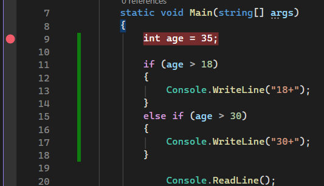
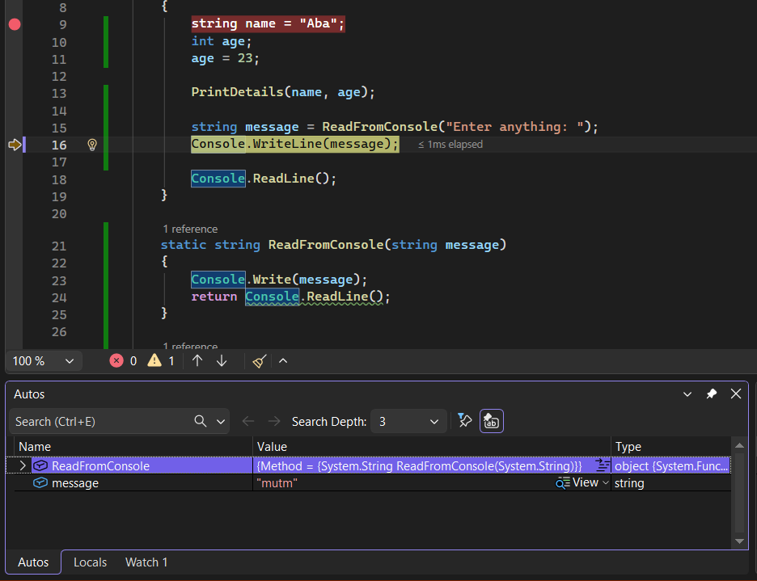
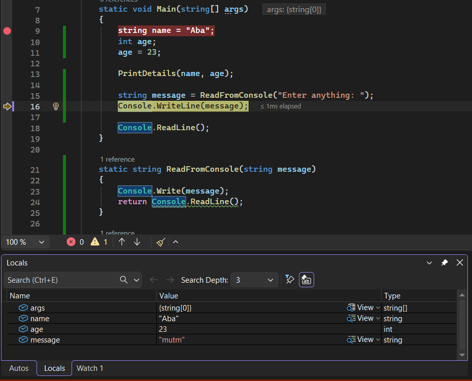
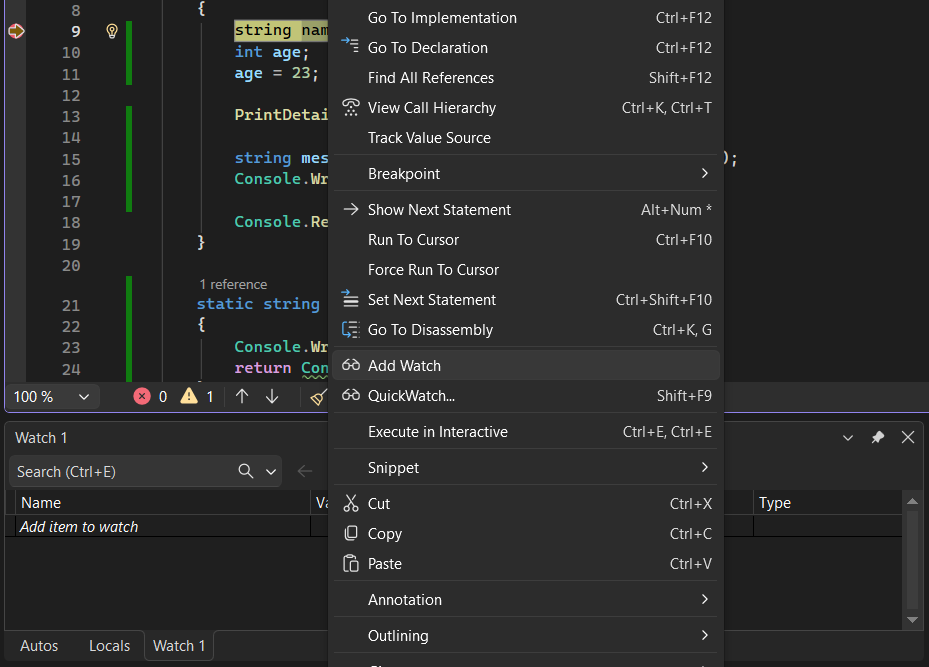
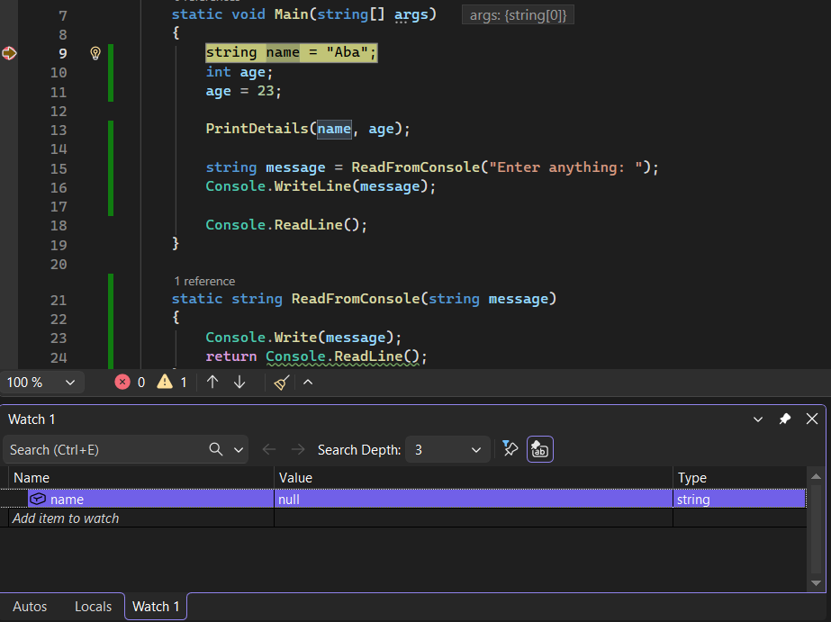

# C# Course 

## Console Write, Convert Data Types
    Console.WriteLine("Hello World!");
    string textAge = "23";
    int age = Convert.ToInt32(textAge);
    Console.WriteLine(age);

## Data Types: Int - Long - Double - Float(Single) - Decimal
The 'L' is to tell the compiler to threat the variable as Int64
    
    long bigNumber2 = -90000000L;
    string textBigNumber = "-90000000";

When converting the 'L' is not need it, because the Convert.ToInt64 is makeing the variable an Int64
    
    long bigNumber = Convert.ToInt64(textBigNumber);
    Console.WriteLine(bigNumber);

The 'D' is to tell the compiler to threat the variable as Double
    
    double neg2 = -55.2D;
    string textNegative = "55.2";

When converting the 'D' is not need it, because the Convert.ToDouble is makeing the variable a Double
    
    double neg = Convert.ToDouble(textNegative);
    Console.WriteLine(neg);

The 'F' is to tell the compiler to threat the variable as Float
    
    float precision2 = 5.000001F;
    string textPrecision = "5.000001";
    
When converting the 'F' is not need it, because the Convert.ToSingle is makeing the variable a Single or Float

    float precision = Convert.ToSingle(textPrecision);
    Console.WriteLine(precision);
    
    
The 'M' is to tell the compiler to threat the variable as Decimal

    decimal money2 = 14.99M;
    string textMoney = "14.99";
    
When converting the 'M' is not need it, because the Convert.ToDecimal is makeing the variable a Decimal

    decimal money = Convert.ToDecimal(textMoney);
    Console.WriteLine(money);

## Data Types: String - Char
    string name = "Aba";
    char letter = 'a';

    Console.Write("Your name is ");
    Console.Write(name);

    Console.WriteLine();
    Console.WriteLine(letter);

## Data Type: Boolean 
    bool value = true;
    bool isMale = true;
    Console.WriteLine(isMale); //Prints True
    isMale = false;
    Console.WriteLine(isMale); //Prints False

## Operators: + - * /
    //int age = 23
    age++;
    age = age + 1;
    age += 1;
    age--;
    age -= 1;
    age *= 2;

    age /= 2; //Result = 2 (Incorrect)

It needs to have a Data Type of Double to represent the correct value

    double age4 = 44;
    age4 /= 10; //Result = 4.4 (Correct)

    //string name = "Aba"
    name += " is programming!";
    //name -= " is programming!"; would throw an Error

    //char letter = 'a';
    //letter += 'b'; would add the two unicode values together 

    int i = 0;
    Console.WriteLine(i++); //Prints 0
    Console.WriteLine(i); //Prints 1
    Console.WriteLine(++i); //Prints 2

Remainder (%)

    int firstNum = 10;
    int secNum = 3;
    Console.WriteLine(firstNum % secNum); //Result = 1

## Var Keyword
Var is a keyword that allows the compiler to infer the type of a variable based on the value assigned to it.

    var age3 = 23; //Int32
    var bigNumber3 = -90000000L; //Int64
    var neg3 = -55.2D; //Double
    var precision3 = 5.000001F; //Single
    var money3 = 14.99M; //Decimal
    var name2 = "Aba"; //String
    var letter2 = 'a'; //Char

## Const Keyword
Const is a keyword that is used to declare a constant variable, 
which means that its value cannot be changed after it has been assigned.

    const int vat = 20;
    //vat = 10; throws an error

    int balance = 1000;

    Console.WriteLine(balance * (vat/100D));

    const double percentage = vat / 100D;
    Console.WriteLine(balance * percentage);

## Exercise: Odd - Even 
    int num1 = 10;
    int num2 = 2;
    int remainder = num1 % num2;
    Console.WriteLine(remainder); //Result 0

    num1 = 11;
    remainder = num1 % num2;
    Console.WriteLine(remainder); //Result 1

## Console Input - Output
    Console.Write("Enter your name: ");
    string name3 = Console.ReadLine();

    Console.Write("Enter your age: ");
    string ageInput = Console.ReadLine(); //Console.ReadLine() can't be an Int
    int age2 = Convert.ToInt32(ageInput);

    //Same as
    int age5 = Convert.ToInt32(Console.ReadLine());

    Console.WriteLine("Your name is " + name3 + " and your age is " + age5);

## if Statement == > >= < <= != || &&
    if (age5 < 0 || age > 150) //OR
    {   Console.WriteLine("Invalid Age!");  }
    else
    {
        if (age5 >= 18 && age5 <= 25) //AND
        {   Console.WriteLine("You are between 18 and 25"); }
        else if (age5 >= 26)
        {   Console.WriteLine("You are 26 or Older");   }
    }

    Console.Write("Enter the first number: ");
    int numA = Convert.ToInt32(Console.ReadLine());

    Console.Write("Enter the second number: ");
    int numB = Convert.ToInt32(Console.ReadLine());

    int result = numA * numB;

    Console.Write("Value of " + numA + " x " + numB + ": ");
    int answer = Convert.ToInt32(Console.ReadLine());

    if (result == answer)
    {   Console.WriteLine("Well Done!");    }
    else
    {   Console.WriteLine("Wrong Answer!"); }

## Switch Statements
    Console.Write("Enter a day of the week: ");
    int day = Convert.ToInt32(Console.ReadLine());

    /*
    if (day == 1)
    {   Console.WriteLine("Mon");   }
    else if (day == 2)
    {   Console.WriteLine("Tue");   }
    */

    switch (day)
    {
        case 1: Console.WriteLine("Mon");
            break;
        case 2: Console.WriteLine("Tue");
            break;
        case 3: Console.WriteLine("Wen");
            break;
        case 4: Console.WriteLine("Thu");
            break;
        case 5: Console.WriteLine("Fri");
            break;
        case 6: Console.WriteLine("Sat");
            break;
        case 7: Console.WriteLine("Sun");
            break;
        default: Console.WriteLine("Invalid, enter a value between 1 and 7");
            break;
    }

## For Loop
    Console.Write("What do you want to repeat?");
    string message = Console.ReadLine();

    Console.Write("And how many times do you want to repeat it?");
    int loopCounter = Convert.ToInt32(Console.ReadLine());

    if (loopCounter <= 0)
    {   Console.WriteLine("Sorry, please enter a value above 0");   }
    else
    {   for (int i = 0; i < loopCounter; i++)
        {   Console.WriteLine(message); }
    }
                
    /*
    for (int i = 0; i <= 10; i += 2)
    {   Console.WriteLine(i);   }
    */

## While Loop - Do While Loop
    /*int i = 0;
    while (i < 10)
    { Console.WriteLine(i);
        i++; }
    */

    Console.Write("Enter the first number: ");
    int numA = Convert.ToInt32(Console.ReadLine());

    Console.Write("Enter the second number: ");
    int numB = Convert.ToInt32(Console.ReadLine());
    Console.WriteLine();

    int result = numA * numB;
    int answer = 0;

    Console.Write("Whats the value of " + numA + " x " + numB + "?");
    Console.WriteLine();

    while (answer != result)
    {
        Console.Write("Enter your answer: ");
        answer = Convert.ToInt32(Console.ReadLine());

        if (result != answer)
        { 
            Console.WriteLine("Wrong Answer!");
            Console.WriteLine();
        }
    }
    Console.WriteLine("Well Done!");

    do
    {
        Console.Write("Enter your answer: ");
        answer = Convert.ToInt32(Console.ReadLine());

        if (result != answer)
        {
            Console.WriteLine("Wrong Answer!");
            Console.WriteLine();
        }
    } while (answer != result);
    Console.WriteLine("Well Done!");

## Conditional Operator or Ternary Operator , Condition ? True : False
    int age = 10;
    /*
    if (age >= 0)
    { Console.WriteLine("Valid"); }
    else
    { Console.WriteLine("Invalid"); }
    */

    string result = age >= 0 ? "Valid" : "Invalid";
    Console.WriteLine(result);

## Numeric Formatting
Numeric formatting is a way to control how numbers are displayed when converted to strings.

    double value = 1000D / 12.34D;

    Console.WriteLine(value);
    Console.WriteLine(string.Format("{0} {1}", value, 1000)); //Result: (value) 1000

    Console.WriteLine(string.Format("{0:0}", value)); //Result: (value) ; with the format 0.00
    Console.WriteLine(string.Format("{0:0.0}", value)); //Result: (value).0 ; with the format 0.00 with trailing 0
    Console.WriteLine(string.Format("{0:0.#}", value)); //Result: (value). ; with the format 0.0 with no trailing 0
    Console.WriteLine(string.Format("{0:0.00}", value)); //Result: (value).00 ; with the format 0.00

    double money = -10D / 3D; //3.3333

    Console.WriteLine(string.Format("-$10 / $3 = ${0:0.00}", money));
    Console.WriteLine(money.ToString("C")); //'C' is to display currency 
    Console.WriteLine(money.ToString("C0")); //'C0' is to display currency with no decimals 
    Console.WriteLine(money.ToString("C1")); //'C1' is to display currency with 1 decimals 
    Console.WriteLine(money.ToString("C2")); //'C2' is to display currency with 2 decimals 

    Console.WriteLine(money.ToString("C", CultureInfo.CurrentCulture));
    Console.WriteLine(money.ToString("C", CultureInfo.CreateSpecificCulture("en-GB")));
    Console.WriteLine(money.ToString("C", CultureInfo.CreateSpecificCulture("en-AU")));

## TryParse Function
TryParse is a method that attempts to convert a string representation of a number to its numeric equivalent.

    bool success = true;
    //bool success = int.TryParse(numInput, out int num)

    while (success)
    {
        Console.Write("Enter a number: ");
        string numInput = Console.ReadLine();

        if (int.TryParse(numInput, out int num))
        {
            Console.WriteLine(num);
            success = false;
        }
        else
        {
            Console.WriteLine("Failed to Convert!");
        }
    }

## Exercise: Times Table
    Console.Write("Enter a number: ");
    int num = Convert.ToInt32(Console.ReadLine());

    for (int i = 1; i <= 10; i++)
    {
        Console.WriteLine("{0} x {1} = {2}", i, num, i*num); //Conditional Format
    }

## Exercise: Fizz Buzz Game
    bool threeDiv = false;
    bool fiveDiv = false;

    for (int i = 1; i <= 15; i++)
    {
        threeDiv = i % 3 == 0;
        fiveDiv = i % 5 == 0;

        if (threeDiv && fiveDiv)
        {
            Console.WriteLine("FizzBuzz");
        }
        else if (threeDiv)
        {
            Console.WriteLine("Fizz");
        }
        else if (fiveDiv)
        {
            Console.WriteLine("Buzz");
        }
        else
        {
            Console.WriteLine(i);
        }
    }

## Verbatim String Literal @
Verbatim: @ negate all the escape characters, \ the back slash is used for escape characters, like \t \n

    string speech = "He said \"something\""; //Example

    string path = "C:\\Users\\CoffeeNCode\\Desktop\\#C Course\nNew line test";
    Console.WriteLine(path);

    //$ String Interpolation
    //$"Your name is {name}"

    //+ to Concatenate 2 Variables
    //"Your name is " + name

    
    path = @"C:\Users\CoffeeNCode\Desktop\#C Course\n";
    path = @"C:\Users\CoffeeNCode\Desktop\#C Course" + "\nNew line test";
    Console.WriteLine(path);

    string name = @"Hello ""someone"""; //Result: Hello "someone"
    Console.WriteLine(name);

    name = "Hello 'someone'"; //Result: Hello 'someone'
    Console.WriteLine(name);

## String Formatting ({0})
    string name = "Aba";
    int age = 23;

    Console.WriteLine("Name: " + name);
    Console.WriteLine("Age: " + age);
    Console.WriteLine("Name: " + name + "\nAge: " + age);
    Console.WriteLine("Name: {0}\nAge: {1}", name, age); //Composite Formatting

    Console.WriteLine("Your name is " + name + ", and your age is " + age);
    Console.WriteLine("Your name is {0}, and your age is {1}", name, age); //Composite Formatting

## String Interpolation ($)
String Interpolation is a way to format strings by embedding expressions directly within string literals, 
using the $ symbol before the string.

    string name = "Aba";
    int age = 23;

    Console.WriteLine("Your name is " + name + ", and your age is " + age);
    Console.WriteLine($"Your name is {name}, and your age is {age}"); //String Interpolation

## String Concatenation
String Concatenation is the process of combining two or more strings into one string.

    string name = "Aba";
    int age = 23;

    Console.WriteLine("Your name is " + name + ", and your age is " + age);
    Console.WriteLine($"Your name is {name}, and your age is {age}"); //String Interpolation
    Console.WriteLine("Your name is {0}, and your age is {1}", name, age); //Composite Formatting

    string test = string.Concat("Your name is ", name, " and your age is ", age); 
    Console.WriteLine(string.Concat("Your name is ", name, " and your age is ", age)); //String Concatenation

    string[] names = new string[] { "Aba ", "Test ", "Test" };
    Console.WriteLine(string.Concat(names));

## Empty String
    Console.Write("Enter your name: ");
    string name = Console.ReadLine();
    //name = "";
    //name = string.Empty;

    if (name != string.Empty) //Is more maintainable and readable than ""
    {
        Console.WriteLine($"Your name is {name}");
    } else
    {
        Console.WriteLine("Name is empty");
    }

## String Equals Function
String.Equals is a method that compares two strings for equality, and it is case-sensitive by default.

    string message = "Hello";
    string compare = "Hello";

    if (message.Equals(compare))//message == compare
    {
        Console.WriteLine("Same");
    }
    else
    {
        Console.WriteLine("Diff");
    }

    Console.WriteLine("Enter your name: ");
    string name = Console.ReadLine();

    if (!name.Equals("")) //name != ""
    {
        Console.WriteLine("Your name is " + name);
    }
    else
    {
        Console.WriteLine("Invalid name input");
    }

    char[] chars = new char[] { 'H', 'e', 'l', 'l', 'o' };
    object newCompare = new string(chars);

    if (message.Equals(newCompare)) //is concerned only about the values rather where is in memory
    //if do message == newCompare it will give "Different", because is comparing based in where is in memory
        Console.WriteLine("Same");
    else
        Console.WriteLine("Different");

## String Iteration Loop
    string message = "C# is awesome";

    /*
    Console.WriteLine(message[0]); //Returns: C
    Console.WriteLine(message[1]); //Returns: #
    Console.WriteLine(message[2]); //Returns: " "
    Console.WriteLine(message[3]); //Returns: i
    */

    for (int i = 0; i < message.Length; i++)
    { 
        Console.Write(message[i]);
        // System.Threading.Thread.Sleep(1000);
        Thread.Sleep(50); //ms
    }

    Console.WriteLine();
    Console.WriteLine(message.Contains("C"));

    bool contains = false;
    for (int i = 0; i < message.Length; i++)
    { 
        if (message[i].Equals('C'))
        {
            contains = true;
        }
    }
    Console.WriteLine(contains);

## String IsNullOrEmpty Function
    Console.Write("Enter your name: ");
    //string name = Console.ReadLine();
    string name = null;

    Console.WriteLine($"Your name is {name}");

    //if (name != "")
    //Console.WriteLine("0");

    //if (!name.Equals(""))
    //Console.WriteLine("1");

    if (!string.IsNullOrEmpty(name)) //null ""
    {
        if (!name.Equals("Aba"))
        {
            Console.WriteLine("Correct");
        }
    }

## Exercise: Print String in Reverse
    Console.Write("Enter your message: ");
    string message = Console.ReadLine();

    for (int i = 0; i < message.Length; i++)
    {
        Console.Write(message[i]);
    }

    Console.WriteLine();

    for (int i = message.Length - 1; i >= 0; i--) //Reverse
    {
        Console.Write(message[i]);
    }

## Excersise: Password Checker
    Console.Write("Enter password: ");
    string password = Console.ReadLine();
            
    Console.Write("Enter password again: ");
    string passwordC = Console.ReadLine();

    if (!password.Equals(string.Empty))
    {
        if (!passwordC.Equals(string.Empty))
        {
            if (password.Length >= 6 && passwordC.Length >= 6)
            {
                if (password.Equals(passwordC))
                {
                    Console.WriteLine("Passwords match");
                }
                else
                {
                    Console.WriteLine("Passwords do not match");
                }
            }
            else
            {
                Console.WriteLine("Please enter 6 or more characters!");
            }
                    
        }
        else
        {
            Console.WriteLine("Please enter a password confirmation");
        }
                
    } else
    {
        Console.WriteLine("Please enter a password");
    }

## Arrays
An array is a data structure that can hold a fixed number of values of the same type.

    int num1 = 5;
    int num2 = 10;
    int num3 = 15;

    /*
    Console.Write("Enter a number: ");
    numbers[0] = Convert.ToInt32(Console.ReadLine());
            
    Console.Write("Enter a number: ");
    numbers[1] = Convert.ToInt32(Console.ReadLine());
            
    Console.Write("Enter a number: ");
    numbers[2] = Convert.ToInt32(Console.ReadLine());
            
    Console.Write("Enter a number: ");
    numbers[3] = Convert.ToInt32(Console.ReadLine());
    */

    int[] numbers = new int[4];

    for (int i = 0; i < numbers.Length; i++)
    {
        Console.Write("Enter a number: ");
        numbers[i] = Convert.ToInt32(Console.ReadLine());
    }

    for (int i = 0; i < numbers.Length; i++)
    {
        Console.Write($"{numbers[i]} ");
    }

    Console.WriteLine();

    foreach (int num in numbers)
    {
        Console.Write($"{num} ");
    }

## Exercise: Triangle
    //Array Solution
    const int angleCount = 3;
    int[] angles = new int[angleCount];

    for (int i = 0; i < angles.Length; i++)
    {
        Console.Write($"Enter angle {i + 1}: ");
        angles[i] = Convert.ToInt32(Console.ReadLine());
    }

    int angleSum = 0;

    foreach (int angle in angles)
    {
        angleSum += angle;
    }

    Console.WriteLine(angleSum == 180 ? "Valid": "Invalid");

    //No Array Solution
    const int angleCount = 3;
    int angleSum = 0;

    //int[] angles = new int[angleCount];

    for (int i = 0; i < angleCount; i++)
    {
        Console.Write($"Enter angle {i + 1}: ");
        angleSum += Convert.ToInt32(Console.ReadLine());
    }

    Console.WriteLine(angleSum == 180 ? "Valid": "Invalid");

## Array Sorting
    int[] numbers = new int[]
    {
        9, 2, 3, 1, 5, 0, 7, 8, 9
    };

    Array.Sort(numbers); //Return void (nothing) but changes the original array order

    foreach (int number in numbers)
    {
        Console.Write($"{number} ");
    } 

## Array Reversal
    int[] numbers = new int[]
    {
        0, 1, 2, 3, 4, 5, 6, 7, 8, 9
    };

    int[] sorted = new int[numbers.Length];

    int x = 0;

    for (int i = numbers.Length - 1; i >= 0; i--)
    {
        sorted[x] = numbers[i];
        x++;
    }

    foreach (var num in sorted)
    {
        Console.Write($"{num} ");
    }
    /*
    Array.Reverse(numbers);

    foreach (var item in numbers)
    {
        Console.Write($"{item} ");
    }
    */

## Array Clearing
    int[] numbers = new int[]
    { 1, 2, 3, 4, 5, 6, 7, 8, 9, 10 };

    int[] num = new int[]
    { 1, 2, 3, 4, 5, 6, 7, 8, 9, 10 };

    //Option 1
    Array.Clear(numbers, 0, numbers.Length);
    //Option 2
    for (int i = numbers.Length - 1; i >= 0; i--)
    {
        numbers[i] = default;
    }

    //Option 1
    Array.Clear(num, 5, 5);
    //Option 2
    for (int i = 5; i < 10; i++) //5 6 7 8 9 
    {
        num[i] = default;

    }

    foreach (var item in numbers)
    {
        Console.Write($"{item} ");
    }
    foreach (var item in num)
    {
        Console.Write($"{item} ");
    }

## Array IndexOf
    int[] numbers = new int[]
    {
        90, 199, 22, 50, 30
    };

    Console.Write("Enter number to search: ");

    int search = Convert.ToInt32(Console.ReadLine());

    //Option 1
    //int position = Array.IndexOf(numbers, search);

    //Option 2
    /*int position = -1;

    for (int i = 0; i < numbers.Length; i++)
    {
        if (numbers[i] == search)
        {
            position = i;
        }
    }
    */

    //int position = Array.IndexOf(numbers, search); Would go thourgh the entire array
    //int position = Array.IndexOf(numbers, search, 2); Would go from position 2 to the end
    int position = Array.IndexOf(numbers, search, 2, 1); //Would go through the arrey from position 2 and check 1 element

    //Check if number found
    if (position > -1) //or >=0
    {
        Console.WriteLine($"Number {search} has been found at position {position + 1}");
    }
    else
    {
        Console.WriteLine($"Number {search} has not been found");
    }

## Lists <>
One of the main differences between an Array and a List is that a List can grow and shrink in size, while an Array has a fixed size.

    int[] numbers = new int[3]
    {
        1, 2, 3
    };

    List<int> listNumbers = new List<int>();

    //listNumbers.Add(1);

    for (int i = 0; i < 3; i++)
    {
        Console.Write("Enter a number: ");
        listNumbers.Add(Convert.ToInt32(Console.ReadLine()));
    }

    for (int i = 0; i < listNumbers.Count; i++)
    {
        Console.WriteLine(listNumbers[i]);
    }

    listNumbers.RemoveAt(0);

    foreach (var item in listNumbers)
    {
        Console.WriteLine(item);
    }

## Dictionary
A Dictionary is a collection of key-value pairs, where each key is unique and maps to a specific value. 
It allows for fast retrieval of values based on their associated keys.
    
    //P1
    Dictionary<int, string> names = new Dictionary<int, string>
    {
        //Key Value Pairs
        { 1, "Alice" },
        { 2, "Aba" },
        { 3, "Rabbit" }
    };

    for (int i = 0; i < names.Count; i++)
    {
        KeyValuePair<int, string> pair = names.ElementAt(i);
        Console.WriteLine($"{pair.Key} - {pair.Value}");
    };

    Console.WriteLine();

    foreach (var item in names) //var is same as KeyValuePair<int, string>
    {
        Console.WriteLine($"{item.Key} - {item.Value}");
    }

    //P2
    Dictionary<string, string> teachers = new Dictionary<string, string>
    {
        {  "Math", "Mr. Smith"  },
        { "Science", "Ms. Johnson" },
        { "History", "Mrs. Brown"  }
    };

    if (teachers.TryGetValue("Math", out string teacher))
    {
        Console.WriteLine(teacher);
        teachers["Math"] = "Joe";
    }
    else
    {
        Console.WriteLine("Math teacher not found");
    }

    if (teachers.ContainsKey("Math"))
    {
        teachers.Remove("Math");
    }
    else
    {
        Console.WriteLine("Math not found");
    }

## Exercise: Odd / Even Number Split
    List<int> odd = new List<int>(); 
    List<int> even = new List<int>(); 

    for (int i = 0; i < 20; i++)
    {
        if (i % 2 == 0)
        {
            even.Add(i);
        }
        else
        {
            odd.Add(i);
        }
    }

    Console.WriteLine("Printing even numbers");

    foreach (var item in even)
    {
        Console.Write($"{item } ");
    }

    Console.WriteLine(Environment.NewLine + "Printing odd numbers");

    foreach (var item in odd)
    {
        Console.Write($"{item} ");
    }

## Exercise: Array of Multiples
    int num = 7;
    int length = 5;
    int[] result = new int[length];
    int counter = 0;

    for (int i = 1; i <= result.Length; i++, counter++)
    {
        result[counter] = num * i;
    }

    foreach (int item in result)
    {
        Console.Write($"{item} ");
    }

## Functions / Methods
Function: is a block of code that performs a specific task and can be reused throughout a program

private (default): means that the function can only be used within the class it is defined in

public: means any code can use it, even from other files

static: means that the function belongs to the class and can be called without creating an instance of the class

void: means that the function does not return a value    

    public static void MyFunction()
    {
        Console.WriteLine("Hello from MyFunction!");
    }

 

    class Program
    {
        static void Main(string[] args)
        {
            Test test = new Test();
            test.Welcome();

            Programm.Message();
        }
    }

    class Test
    {
        public void Welcome()
        {
            Console.WriteLine("Welcome, World!");
        }
    }

    class Programm
    {
        public static void Message()
        {
            Test test = new Test();
            test.Welcome();
        }
    }

## Void Functions 
    static void Main(string[] args)
    {
        WelcomeMessage();
        CreateAndPrintAnArray();
    }

    static void WelcomeMessage()
    {
        Console.WriteLine("Welcome to C# Programming!");
    }

    static void CreateAndPrintAnArray()
    {
        int[] numbers = new int[5] { 1, 2, 3, 4, 5 };
        foreach (int number in numbers)
        {
            Console.WriteLine(number);
        }
    }

## Return Type Functions
    class Program
    {
        //static string name = "Aba"; Global variable

        static void Main(string[] args)
        {
            Console.Title = $"{ReturnName()} - {ReturnAge()}";
            PrintIntro();

            int[] numbers = new int[3];

            for (int i = 0; i < numbers.Length; i++)
            {
                numbers[i] = ReadNumberFromConsole();
            }
    
            foreach (int number in numbers)
            {
                Console.Write($"{number} ");
            }

            Console.WriteLine();

            int[] newNumbers = CreateRandomArray();

            foreach (int number in newNumbers)
            {
                Console.Write($"{number} ");
            }

            Console.ReadLine();
        }

        static int[] CreateRandomArray()
        {
            /*
            int[] numbers = new int[3]
            {
                0, 1, 2
            };
            return numbers;
            */
            
            return new int[3]{ 0, 1, 2 };
        }

        static int ReadNumberFromConsole()
        {
            Console.Write("Enter a number: ");
            return Convert.ToInt32(Console.ReadLine());
        }

        static string ReturnName()
        {
            return "Aba";
        }

        static int ReturnAge()
        {
            return 23;
        }

        static void PrintIntro()
        {
            string name = ReturnName();
            int age = ReturnAge(); 
            string output = $"Hello my name is {name} and my age is {age}";
            Console.WriteLine(output);
            //Console.WriteLine($"Hello my name is {ReturnName()} and my age is {ReturnAge()}");
        }
    }

## Function Parameters
Function parameters are variables that are passed to a function when it is called, 
and they allow the function to perform its task using the values provided by the caller.

    static void Main(string[] args)
    {
        Console.WriteLine(Add(5, 5));

        int num1 = ReadInt("Enter number");

        int num2 = ReadInt("side");

        int firstNum = ReadInt("Enter first number");
        int secondNum = ReadInt("Enter second number");
        int result = Add(firstNum, secondNum);

        Console.WriteLine(result);

        string name = ReadString("Enter your name");
        int age = ReadInt("Enter your age");

        string details = UserDetails(name, age);
        Console.WriteLine(details);

        Console.ReadLine();
    }

    static string UserDetails(string name, int age)
    {
        return $"Hello my name is {name} and my age is {age}.";
    }

    static string ReadString(string message)
    {
        Console.Write($"{message}: ");
        return Console.ReadLine();
    }

    static int ReadInt(string message)
    {
        Console.Write($"{message}: ");
        return Convert.ToInt32(Console.ReadLine()); 
    }

    static int Add(int a, int b)
    {
        return a + b;
    }

## Optional Parameters
Optional parameters are parameters that have a default value, and they can be omitted when calling the function.

    static void Main(string[] args)
    {
        int result = Add(5);
        Console.WriteLine(result);

        PrintName();

        Console.ReadLine();
    }

    static void PrintName(string name = "Aba")
    {
        Console.WriteLine($"My name is {name}");
    }

    //static int Add(int a, int b = 50)
    //static int Add(int a, int b = default)
    //static int Add(int a, int b = 0)
    static int Add(int a, [Optional] int b)
    {
        return a + b;
    }

## Named Parameters
Named parameters allow you to specify the arguments for a function by name, rather than by position

    static void Main(string[] args)
    {
        string nameInput = "Aba";
        int ageInput = 23;
        string addressInput = "123 Main St";

        //PrintInfo(name, age, address);
        PrintInfo(age: ageInput, 
                  name: nameInput, 
                  address: addressInput);

        Console.ReadLine();
    }

    static void PrintInfo(string name, int age, string address)
    {
        Console.WriteLine($"Name: {name}");
        Console.WriteLine($"Age: {age}");
        Console.WriteLine($"Address: {address}");
    }

## Out Parameters
Out parameters are parameters that are passed by reference and are used to return multiple values from a function.

    static void Main(string[] args)
    {
        int num = 0;
        bool success = test(out num);

        Console.WriteLine(num);
        Console.WriteLine(success);

        List<string> shoppingList = new List<string>
        {"Milk", "Bread", "Eggs"};

        Console.WriteLine(shoppingList.IndexOf("Milk"));

        Console.WriteLine(FindInList("Milk", shoppingList, out int index));
        Console.WriteLine(index);

        Console.Write("Enter item to search for: ");
        string search = Console.ReadLine();

        if (FindInList(search, shoppingList, out index))
        {
            Console.WriteLine($"Found {search} at index {index}");
        }
        else
        {
            Console.WriteLine("Not found");
        }

        /*
        int index = -1;
        for (int i = 0; i < shoppingList.Count; i++)
        {
            if (shoppingList[i].ToLower().Equals("bread"))
            {
                index = i;
            }
        }
        bool found = index > -1;
        Console.WriteLine(found ? "Found" : "Not found");
        */

        Console.ReadLine();
    }

    static bool FindInList(string s, List<string> list, out int index)
    {
        index = -1;

        for (int i = 0; i < list.Count; i++)
        {
            if (list[i].ToLower().Equals(s.ToLower()))
            {
                index = i;
            }
        }
         return index > -1;
    }

    static bool test(out int num)
    {
        num = 5;
        return true;
    }

## Reference Parameters
Difference between ref and out parameters, is that out parameters must be assigned a value before the function returns, 
while ref parameters must be initialized before being passed to the function. 

Error

    static void Assign(out int num)
    {
    }

    ChangeName(ref int name, newName)
    
Good

    static void Assign(ref int num)
    {
    }

    string name = "Aba";
    ChangeName(ref name, newName)

    ChangeName(out int name, newName)

 

    static void Main(string[] args)
    {
        int num = 10;
        Assign(ref num);

        string name = "Aba";
        Console.Write("Enter your new name: ");
        string newName = Console.ReadLine();

        if (ChangeName(ref name, newName))
        {
            Console.WriteLine($"Your new name is {newName}");
        }
        else
        {
            Console.WriteLine("New name cannot be empty or null");
        }

        Console.ReadLine();
    }

    static bool ChangeName(ref string name, string newName)
    {
        if (!string.IsNullOrEmpty(newName))
        {
            name = newName;
            return true;
        }
        return false;
    }

    static void Assign(ref int num)
    {
        num = 20;
    }
    
    
## Exercise: Area of a Triangle
    static void Main(string[] args)
    {  
        int width = ReadInt("width");
        int height = ReadInt("height");

        Console.WriteLine($"The area is {CalcArea(width, height)}");

        Console.ReadLine();
    }

    static int CalcArea(int width, int height)
    {
        return (width * height) / 2;
    }

    static int ReadInt(string message)
    {
        Console.Write($"Enter {message}: ");
        return Convert.ToInt32(Console.ReadLine());
    }

## Exercise: Sum of int Array
    static void Main(string[] args)
    {
        int[] numbers = new int[] { 1, 2, 3, 4, 5 };

        int result = SumOfNumbers(numbers);
        if (result > -1)
        {
            Console.WriteLine($"The total is: {result}");
        }
        else
        {
            Console.WriteLine("Cannot add up an empty array");
        }

        if (SumOfNumbers(numbers, out int total))
        {
            Console.WriteLine($"The total is: {total}");
        }
        else
        {
            Console.WriteLine("Cannot add up an empty array");
        }

        Console.ReadLine();
    }

    static int SumOfNumbers(int[] numbers)
    {
        if (numbers.Length > 0)
        {
            int total = 0;
            foreach (int number in numbers)
            {
                total += number;
            }
            return total;
        }
        return -1;
    }

    static bool SumOfNumbers(int[] numbers, out int total)
    {
        total = 0;
        if (numbers.Length > 0)
        {
            foreach (int number in numbers)
            {
                total += number;
            }
            return true;
        }
        return false;
    }

## Exception Handling
Exception handling is a mechanism to handle runtime errors in a controlled manner, 
allowing the program to continue executing or gracefully terminate instead of crashing.

Example:

    int num = Convert.ToInt32(Console.ReadLine());
    Console.WriteLine(num);

If the user enters a non-numeric value, it will throw a: 
System.FormatException: 'The input string 'l' was not in a correct format.'

## Try... catch
Try... catch is a block of code that is used to handle exceptions. 
The code that may throw an exception is placed inside the try block, 
and the code to handle the exception is placed inside the catch block.

    bool looping = true;
    while (looping)
    {
        try
        {
            Console.Write("Enter a number: ");
            int num = Convert.ToInt32(Console.ReadLine());
            Console.WriteLine(num);

            looping = false;
        }
        catch (OverflowException)
        {
            Console.WriteLine("Please enter a number smaller than 2 billion");
        }
        catch (FormatException)
        {
            Console.WriteLine("Please only enter numbers");
        }
        catch (Exception) // catch all exceptions
        {
            Console.WriteLine("Something has went wrong");
        }
    }

    Console.WriteLine("Goodbye!");

    Console.ReadLine();

## Printing Error Messages
    try
        {
            Console.Write("Enter a number: ");
            int num = Convert.ToInt32(Console.ReadLine());
            Console.WriteLine(num);
        }
        catch (FormatException)
        {
            Console.WriteLine("Please only enter numbers!");
        }
        catch (OverflowException)
        {
            Console.WriteLine("Please enter a value under 2 billion");
        }
        catch (Exception e)
        { 
            Console.WriteLine($"Error: {e.Message}");
        }
        Console.WriteLine("Goodbye!");

## Exercise: Custom TryParse
    static void Main(string[] args)
    {
        /*
        bool success = false;
        while (!success)
        {
            try
            {
                Console.Write("Enter a number: ");
                int num = Convert.ToInt32(Console.ReadLine());
                Console.WriteLine(num);
                success = true;
            }
            catch (Exception e)
            {
                Console.WriteLine($"Error: {e.Message}");
            }
            Console.WriteLine(success ? "Yey" : "Oh no");
        }
        */
        Console.Write("Enter a number: ");
        if (TryParse(Console.ReadLine(), out int result))
        {
            Console.WriteLine(result);
        }
        else
        {
            Console.WriteLine("Invalid input");
        }

        Console.ReadLine();
    }
    
    static bool TryParse(string input, out int result)
    {

        try
        {
            result = Convert.ToInt32(input);
            return true;

        }
        catch (Exception)
        {
            result = -1;
            return false;
        }
    }

## Debugging

  

    static void Main(string[] args)
    {
        string name = "Aba";
        int age;
        age = 23;

        PrintDetails(name, age);

        string message = ReadFromConsole("Enter anything: ");
        Console.WriteLine(message);

        Console.ReadLine();
    }

    static string ReadFromConsole(string message)
    {
            Console.Write(message);
            return Console.ReadLine();
    }

    static void PrintDetails(string name, int age)
    {
        Console.WriteLine($"Name: {name}, Age: {age}");
        Console.WriteLine($"Name: {name}, Age: {age}");
        Console.WriteLine($"Name: {name}, Age: {age}");
        Console.WriteLine($"Name: {name}, Age: {age}");
        Console.WriteLine($"Name: {name}, Age: {age}");
    }

##  Auto Window / Local Window
### Autos Window
Shows variables that are automatically relevant to the current line of code.
> Variables used in the current line  
> Variables used in the previous line   
> Values returned by functions on that line  

  

### Locals Window
Shows all variables available in the current scope.
> All local variables inside the current method/function  
> Their current values  
> Objects expanded with their properties  

  

## Watch Window
Add a Variable to the Watch Window

  

Watch Window 

  

## Exercise: Fix Logic Error
From:

    int age = 35;
    if (age > 18)
    {
        Console.WriteLine("Over 18");
    }
    else if (age > 30)
    {
        Console.WriteLine("Over 30");
    }
    else if (age > 50)
    {
        Console.WriteLine("Over 50");
    }

To:
    
    int age = 35;
    if (age > 18 && age < 30)
    {
        Console.WriteLine("Over 18");
    }
    else if (age > 30 && age < 50)
    {
        Console.WriteLine("Over 30");
    }
    else if (age > 50)
    {
        Console.WriteLine("Over 50");
    }
    

## Structures
Structures are value types that can contain data and methods, 
and they are typically used to represent simple data structures.

    struct Person
    {
        public string name;
        public int age;

        public Person(string name, int age)
        {
            //Can't name = name,
            //So change the global var "name" to something else, like "Name" and then assign it, like "Name = name";
            this.name = name; 
            this.age = age;
        }
    }

    static void Main(string[] args)
    {
        string name = "Aba";
        int age = 30;

        Person person;
        person.name = "Aba";
        person.age = 30;

        string newName = ReturnPerson(out int newAge);
        
        string newName2 = "";
        int newAge2 = 0;
        ReturnPerson2(ref newName2, ref newAge2);

        Person person2 = ReturnPerson3();

        Console.WriteLine($"{name} - {age}");
        Console.WriteLine($"{person.name} - {person.age}");
        Console.WriteLine($"{newName} - {newAge}");
        Console.WriteLine($"{newName2} - {newAge2}");
        Console.WriteLine($"{person2.name} - {person2.age}");

        Console.ReadLine();
    }

    static string ReturnPerson(out int age)
    {
        Console.Write("Enter your name: ");
        string name = Console.ReadLine();

        Console.Write("Enter your age: ");
        age = Convert.ToInt32(Console.ReadLine());

        return name;
    }

    static void ReturnPerson2(ref string name, ref int age)
    {
        Console.Write("Enter your name: ");
        name = Console.ReadLine();

        Console.Write("Enter your age: ");
        age = Convert.ToInt32(Console.ReadLine());

    }

    static Person ReturnPerson3()
    {
        Console.Write("Enter your name: ");
        string name = Console.ReadLine();

        Console.Write("Enter your age: ");
        int age = Convert.ToInt32(Console.ReadLine());

        /*
            Person person;
            person.name = name;
            person.age = age;

            return person;
        */

        //Because we have a constructor in the structure,
        //We can directly return a new instance of the structure with the values assigned to it.
        
        return new Person(name, age);
    }

## Classes
The difference between a class and a structure is that a structure constructure needs to have parameters,
while a class constructor can be parameter less

    /*
    struct Person
    {
        public string name;
        public int age;

        public Person(string name = "", int age = 0)
        {
            this.name = name;
            this.age = age;
        }
    }
    */

    class Person
    {
        public string name;
        public int age;
        public Person()
        {
        }
        public Person(string name)
        {
            this.name = name;
        }
        public Person(int age)
        {
            this.age = age;
        }
        public Person(string name, int age)
        {
            this.name = name;
            this.age = age;
        }
    }
    static void Main(string[] args)
    {
        Person person = new Person("Aba", 23);
        Console.WriteLine(person.name);
        Console.WriteLine(person.age);

        Console.ReadLine();
    }

## Class Functions

## Class Fields 

## Class Variable / Function Scope

## Class Properties

## Class ToString Function Overrid

## Outro?

